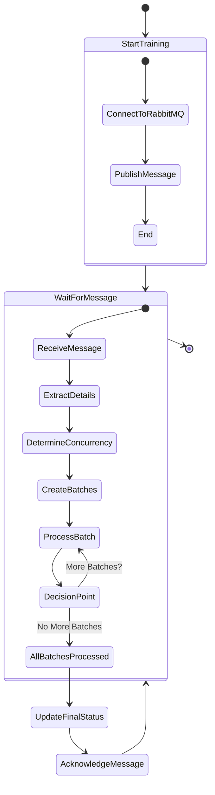

# Scalable Fault-Tolerant Document Training

This document details a scalable and robust approach for parallelizing document training in a multi-tenant, distributed document search service. It leverages asynchronous processing, RabbitMQ for task queuing, and mechanisms to handle consumer VM failures and monitor system health.

## 1. System Architecture

The architecture consists of the following components:

- **Tenant VMs**: Each tenant interacts with the service through a tenant VM. This VM initiates training requests by sending messages to the task queue.
- **RabbitMQ Queue**: A distributed task queue acts as a central message broker, holding training tasks (messages) waiting to be processed.
- **Consumer VMs**: Multiple VMs process training tasks asynchronously. They retrieve messages from the queue, process the documents, and update the central status tracker.
- **Central Status Tracker**: This component stores the overall training status for each tenant's request (training task ID) and optionally individual document processing statuses.

### State Diagram


## 2. Workflow

### Tenant Initiates Training

The tenant VM prepares a message containing:

- `tenant_id`: Unique identifier for the tenant.
- `documents`: List of document IDs or document data (depending on implementation).
- `pricing_plan`: Tenant's pricing plan (e.g., "free," "paid").
- `training_task_id`: Unique identifier for this training task.

It sends the message to the RabbitMQ queue.

### Consumer VM Receives Task

1. A consumer VM retrieves a message from the queue.
2. It extracts the `tenant_id`, `documents`, `pricing_plan`, and `training_task_id` from the message.
3. It determines the maximum concurrent document processing allowed based on the pricing plan (using `get_max_concurrency` function).

### Asynchronous Document Processing

The consumer VM processes documents in batches with the concurrency limit:

1. It iterates through the documents list in batches.
2. For each batch, it creates asynchronous tasks (using a library like asyncio) to process up to `max_concurrency` documents concurrently.
3. After processing each batch, it updates the overall status in the central tracker (e.g., "Processing X out of Y documents").

### Document Processing

Each asynchronous task within a batch:

1. Retrieves a document ID or data from the batch.
2. Processes the document (e.g., OCR, layout identification, text extraction, embedding creation).
3. Updates the document's status in the central status tracker (optional).

### Task Completion and Fault Tolerance

1. The consumer VM acknowledges the message with RabbitMQ only after all documents in the message are processed successfully.
2. If the consumer VM crashes before acknowledging, RabbitMQ will automatically re-queue the message for another consumer VM to handle (fault tolerance).

### Optional: Resuming from Last Processed Document

1. The central status tracker can store the `last_processed_id` for each training task.
2. In case of a consumer VM failure and task re-queuing, the message could be augmented with the `last_processed_id`.
3. The new consumer VM can then resume processing from that point, improving efficiency (optional).

### Training Completion

1. After all documents in a task are processed, the consumer VM updates the central status tracker to "Completed".

### Tenant Monitors Training Status

The tenant VM periodically queries the central status tracker using the `training_task_id` to retrieve the latest overall training progress and optionally individual document statuses.

## 3. Code Example (Python using pika and asyncio)

### Producer (Tenant VM)
```python
import json
import pika

def initiate_training(documents, tenant_id, pricing_plan):
    connection = pika.BlockingConnection(pika.ConnectionParameters(host="localhost"))
    channel = connection.channel()
    training_task_id = generate_unique_training_task_id()
    message = {
        "tenant_id": tenant_id,
        "documents": documents,
        "pricing_plan": pricing_plan,
        "training_task_id": training_task_id,
    }
    channel.basic_publish(exchange="", routing_key="training_queue", body=json.dumps(message))
    connection.close()

    # Monitor training status (implementation depends on your chosen approach)
```

### Consumer (Training VM)
```python
import asyncio
import json
import pika

def get_max_concurrency(pricing_plan):
    # Implement logic to return concurrency limit based on pricing plan (e.g., 5 for free, 30 for paid)

async def train_document(document_id, document_data):
    # Process the document asynchronously
    ...
    await update_training_status(training_task_id, document_id, "Completed")  # Update central status

async def worker():
    connection = pika.BlockingConnection(pika.ConnectionParameters(host="localhost"))
    channel = connection.channel()
    channel.queue_declare(queue="training_queue")

    async def callback(ch, method, properties, body):
        message = json.loads(body)
        tenant_id = message["tenant_id"]
        documents = message["documents"]
        pricing_plan = message["pricing_plan"]
        training_task_id = message["training_task_id"]
        max_concurrency = get_max_concurrency(pricing_plan)

        # Process documents in batches with concurrency limit
        for i in range(0, len(documents), max_concurrency):
            batch_documents = documents[i:i+max_concurrency]
            tasks = [train_document(doc_id, doc_data) for doc_id, doc_data in batch_documents]
            await asyncio.gather(*tasks)

            # Update overall status in central tracker (e.g., "Processing X out of Y documents")
            update_training_status(training_task_id, processed=len(batch_documents), total=len(documents))

        # All documents processed, update status to "Completed"
        update_training_status(training_task_id, "Completed")
        channel.basic_ack(delivery_tag=method.delivery_tag)

    channel.basic_consume(queue="training_queue", on_message_callback=callback)
    await asyncio.Future()  # Keeps the connection open

async def main():
    asyncio.create_task(worker())
    await asyncio.gather()

if __name__ == "__main__":
    asyncio.run(main())
```

## 4. Central Status Tracker

The central status tracker can be implemented using a database (e.g., MySQL, PostgreSQL) or a key-value store (e.g., Redis, Memcached).

It stores information for each training task:

- `training_task_id`: Unique identifier for the training task.
- `tenant_id`: Tenant associated with the training task.
- `overall_status`: Overall training status for the task (e.g., "Queued," "Processing X out of Y documents," "Completed," "Failed").
- `document_statuses` (optional): A dictionary or list to track individual document processing statuses within the training task (e.g., document ID mapped to "Completed" or "Failed").

## 5. Monitoring

### Queue Length

Monitor the length of the RabbitMQ queue using tools like RabbitMQ Management Plugin or Prometheus. A long queue length could indicate slow processing or insufficient consumer VMs.

### Consumer VM Health

Monitor the health of consumer VMs (CPU, memory utilization). Implement mechanisms to remove unhealthy VMs from processing tasks. Consider using a service discovery mechanism like ZooKeeper to register and discover healthy consumer VMs.

### Concurrency Limit Adjustment (Optional)

If monitoring reveals consistent queue growth or overloaded consumer VMs, dynamically adjust the `max_concurrency` limit based on available resources. This could involve a separate service that monitors queue length and VM health and adjusts the limit accordingly.

## 6. Benefits

- **Scalability**: The approach scales horizontally by adding more consumer VMs to handle increased document processing load.
- **Efficiency**: Asynchronous processing utilizes CPU cores effectively and improves processing speed.
- **Fault Tolerance**: Re-queuing messages in case of consumer VM failures ensures all documents are eventually processed.
- **Monitoring**: Monitoring tools enable proactive identification of bottlenecks and optimization of resource utilization.
- **Flexibility**: Pricing plans can be easily enforced by adjusting the concurrency limit.

## 7. Conclusion

This approach ensures efficient, parallel document training while handling potential failures and providing monitoring capabilities. The asynchronous processing, fault tolerance mechanisms, and monitoring features contribute to a robust and scalable solution for multi-tenant document search services.

### Additional Considerations

- Implement robust error handling to prevent cascading failures in case of document processing issues.