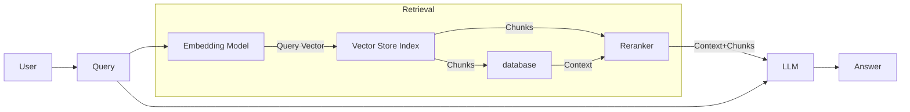

# Unlocking Efficiency and Accuracy in E-commerce Customer Support with SearchAI RAG

In the fast-paced realm of e-commerce, customer support efficiency can make or break a company's reputation. In our latest project, we deployed a SearchAI Retrieval-Augmented Generation (RAG) solution for a client to enhance their customer care agents' ability to provide accurate and timely answers using the rich information contained in their knowledge repository. Here's a deep dive into our journey, challenges faced, and the solutions that led us to an optimal balance between cost-efficiency and accuracy.

## The Challenge

Our goal was to handle an expected load of 500 million requests per year, or approximately 40 million requests per month. The core use case was straightforward: whenever a customer posed a question to an agent, the SearchAI system would automatically fetch the most relevant answers from a pre-ingested knowledge base.

## Technical Blueprint

Here’s a high-level illustration of our initial SearchAI RAG architecture:

## Initial Implementation and Challenges

The key initial setup involved chunking knowledge articles in HTML format and feeding these chunks through GPT-3.5-turbo-16k, as it supported the required token budget (approximately 6500 tokens per query). This approach yielded an answering accuracy of 80%. However, the financial implications were staggering—the annual LLM bill soared to $2 million.

## Improving Cost-Efficiency

To cut costs in half while maintaining accuracy, we needed to improve chunk retrieval precision and recall. Our retrieval evaluation utilized a test suite with a set of questions and a ranked list of relevant chunks, ensuring any enhancement could be rigorously validated.

Here’s a breakdown of our systematic approach:

### 1. Fine-Tuning Embedding Models

Fine-tuning an embedding model on our client's dataset emerged as a critical step. We refined the embedding model, leveraging a custom-built utility to fine-tune any embedding model easily. 

### 2. Exploring Stock Embedding Models

Different models were experimented with:

- **QA MPnet Base (SearchAI default embedding Model)**
- **E5 Base Model**
- **Finetuned BGE Base model on eBay dataset**
- **OpenAI ADA embeddings**

### 3. Document Format Conversion

Recognizing that HTML data might not be embedding model-friendly, we explored converting documents into Markdown or Plain Text. This included formats such as:

- Raw HTML
- Markdown
- Split Markdown using LangChain MarkdownHeaderTextSplitter
- Clean Text

### 4. Optimizing Chunking Strategies

Chunking the documents effectively is critical for maximizing retrieval accuracy and managing token budgets. Here’s a detailed look into the chunking strategies we explored:

#### Layout-Sensitive Chunking

We observed that maintaining the relative layout and structure of the original HTML documents led to better contextual understanding and retrieval accuracy. For this, we experimented with various chunk sizes and formats:

- **Chunk Size and Number**: We experimented with different chunk sizes (e.g., 200 tokens, 400 tokens) and the number of chunks per query (e.g., 8 chunks, 16 chunks). Smaller chunks (e.g., 200 tokens) generally preserve more context around specific details, while larger chunks (e.g., 400 tokens) provide broader context but may slightly dilute specific information.
  
- **Order and Proximity**: Ensuring the proximity of the chunks to the query in the prompt was vital for the LLM to generate relevant answers. The order in which chunks appear relative to the query also influences the quality of the answers, with more semantically relevant chunks placed nearer to the query.

#### Format-Sensitive Chunking

Beyond layout, the document format plays a crucial role in embedding generation:

- **Markdown Conversion**: By converting HTML to Markdown, we ensure cleaner, more structured input for embedding models.
- **Plain Text**: Simplifying documents to plain text often removes extraneous data and potential noise.

### 5. Prompt Engineering

Prompt engineering helped in maintaining the proximity of query and chunks, thereby improving the relevance of the answers provided by the LLM.

## Analysis and Top Solutions

Through robust analysis, the most effective solutions in terms of retrieval accuracy were identified as follows:

1. **Clean Text with OpenAI ADA model, chunk size 200, and 16 chunks**: 59.3% retrieval accuracy.
   - *Pros*: Highest retrieval accuracy.
   - *Cons*: Higher computational costs.

2. **Clean Text with OpenAI ADA model, chunk size 200, and 8 chunks**: 58.7% retrieval accuracy.
   - *Pros*: High accuracy, fewer chunks.
   - *Cons*: OpenAI costs remain high.

3. **Clean Text with Finetuned BGE model, chunk size 200, and 8 chunks**: 56.8% retrieval accuracy.
   - *Pros*: Good accuracy, cost-effective after initial finetuning.
   - *Cons*: Slightly lower accuracy, finetuning effort required.

4. **Markdown with OpenAI ADA model, chunk size 400, and 8 chunks**: 54% retrieval accuracy.
   - *Pros*: Decent accuracy, fewer chunks needed.
   - *Cons*: Larger chunks may lose context, expensive OpenAI usage.

## The Optimal Solution

While OpenAI solutions offered higher retrieval accuracy, they were cost-prohibitive. The finetuned BGE model struck an optimal balance, yielding a retrieval accuracy of 56.8% at significantly reduced costs. This was achieved by:

- Converting documents to Clean Text.
- Using the finetuned BGE model for embeddings.
- Employing a chunk size of 200 with 8 chunks per LLM call.

## Conclusion

By adopting the Clean Text with Finetuned BGE model approach, we managed to cut costs dramatically while maintaining satisfactory retrieval accuracy. This solution not only exemplifies the power of fine-tuning but also highlights the importance of thorough analysis and strategic adjustments in building cost-efficient, high-performing systems.

This journey reaffirms the potential for embedding models to revolutionize customer support, offering scalability and accuracy while keeping operational expenses in check.

