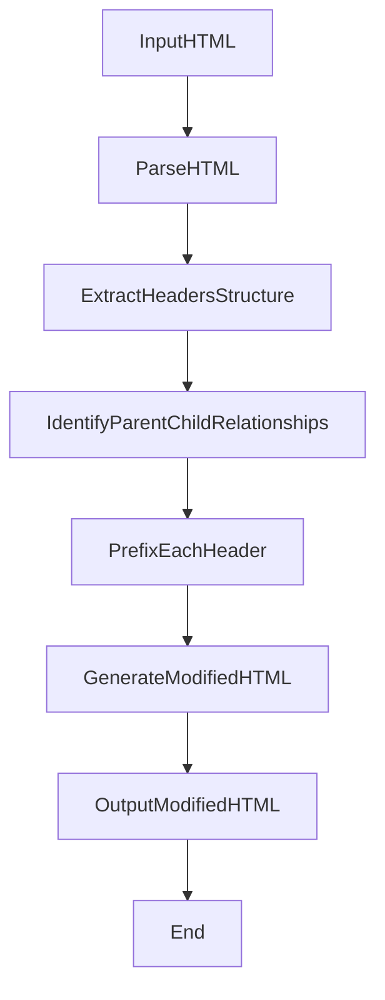

# Solving Document Structure Issues for Knowledge Extraction Using LLMs

When working with knowledge extraction from document repositories, we often encounter challenges related to the structure and organization of the content. In this article, we'll discuss a real-world scenario where our client, PNC, faced two specific problems while using a searchassist platform to retrieve answers from Salesforce knowledge articles.

## The Challenges

1. **Missing Hierarchy Information**: The table of contents within the documents had a hierarchical structure, but the parent-child relationship information was not available in every child section. This made it difficult to accurately capture the context and relationships between different sections.

2. **Incorrect Chunking**: When chunking the content based on tokens, the section headers might inadvertently include information from the previous section, leading to incorrect answers being returned.

## The Solution

To address these issues, we developed a solution that involved preprocessing the HTML documents before chunking and feeding them to the Large Language Model (LLM). Here's a high-level overview of the approach:

1. **Parse HTML**: The first step is to parse the input HTML document to extract its structure and content.

2. **Extract Headers Structure**: From the parsed HTML, we identify and extract the structure of the headers, which represent the sections and subsections of the document.

3. **Identify Parent-Child Relationships**: Using the extracted headers structure, we analyze and identify the parent-child relationships between the different sections and subsections.

4. **Prefix Each Header**: With the identified relationships, we prefix each header with its parent section(s), providing the necessary context and hierarchy information.

5. **Generate Modified HTML**: After prefixing the headers, we generate a modified version of the HTML document that incorporates the updated structure and context.

6. **Output Modified HTML**: The modified HTML document is then ready for further processing, such as chunking and feeding into the LLM for knowledge extraction.

This approach ensures that the LLM receives the necessary context and hierarchical information, enabling it to provide more accurate answers based on the document's structure.

The implementation of this solution is available as an open-source project on GitHub: [SearchAssist-Toolkit](https://github.com/Koredotcom/SearchAssist-Toolkit/tree/master/Extraction/PNC_Extraction_Utility).

## Conclusion

Dealing with complex document structures and hierarchies can be a significant challenge when extracting knowledge using LLMs. By preprocessing the documents and incorporating parent-child relationships, we can provide the LLM with the necessary context and improve the accuracy of the extracted information. The solution presented in this article demonstrates how a combination of HTML parsing, header analysis, and document modification can effectively address these challenges.