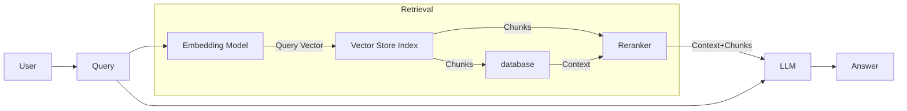

# SearchAI for Customer Support - Our Journey to Cost-Effective AI Solution

## Introduction

In the competitive world of e-commerce, efficient customer support is crucial for a company's reputation and customer retention. Our recent project involved deploying a cost-effective AI solution to improve this efficiency. Our recent project involved deploying a SearchAI Retrieval-Augmented Generation (RAG) solution for a client. This solution uses advanced language models to understand customer questions and provide relevant answers from our vast knowledge base. This cutting-edge technology allowed our customer service agents to deliver timely and precise responses, significantly improving the overall customer experience. 

## Initial Implementation

To give you a better understanding of our initial setup, let me walk you through the process. Whenever a customer asked a question, the SearchAI system would automatically retrieve the most relevant answers from our pre-existing knowledge base. This knowledge base consisted of articles and documents that were segmented into smaller chunks of information, called HTML chunks.
These smaller chunks were then processed through a powerful language model called GPT-3.5-turbo-16k, which had the capability to handle a large number of tokens (roughly equivalent to words) per query. This approach allowed us to achieve an impressive 80% accuracy rate in providing relevant answers to customer queries.

### Technical Blueprint

Here’s a high-level illustration of our initial SearchAI RAG architecture:

## The Challenge

While the initial implementation of the SearchAI system was a success, we soon encountered a significant challenge – the astronomical costs associated with running the powerful language models required for this solution. We anticipated handling an overwhelming 500 million customer requests per year, which translated to a staggering $2 million annual bill for the AI system.
This exorbitant cost was simply unsustainable for our business, and we found ourselves at a crossroads. We had to find a way to maintain the accuracy and efficiency of our AI-powered customer support while drastically reducing the operational costs. It was a daunting task, but our team was determined to find a solution.

Our journey to find a solution took us through several interesting approaches, each offering unique benefits and tradeoffs. We focused on optimizing every step of our process, from how we prepared our data to how we leveraged different AI models. Let's walk through the key strategies we explored:

### Our Journey to a Cost-Effective Solution:

After identifying the challenges we faced, our team embarked on a journey to find innovative ways to reduce costs while maintaining the quality of our AI-powered customer support. We explored several strategies, each offering unique benefits. Let's walk through these approaches in simple terms:

### 1. Exploring Different Embedding Models:
We began by investigating various embedding models, which are crucial components that help our system interpret and represent text. There are many such models available, each with its own strengths. We experimented with several of these, comparing their performance to find the one that offered the best balance of accuracy and cost-efficiency for our specific needs.
### 2. Fine-Tuning Our Language Understanding:
While exploring different models was a good start, we found that off-the-shelf solutions weren't always sufficient for our specific use case. To address this, we employed a technique called "fine-tuning" on the most promising model we had identified. This process involved further training the model on our client's specific data, aiming to make our system even more efficient at understanding and answering customer queries in the context of our client's business. By combining the strengths of existing models with customized training, we hoped to achieve a level of performance that neither approach could deliver on its own.

### 3. Improving How We Store Information:
We realized that the way we stored our knowledge base could impact how well our system understood it. We tried converting our information into different formats, such as plain text and a special format called Markdown, to see which worked best with our system.

### 4. Optimizing Information Chunks:
Instead of processing larger documents at once, we broke them down into smaller, more manageable pieces. We experimented with different sizes of these 'chunks' and how many to use for each query, aiming to find the most efficient way to process information.

### 5. Optimizing Prompts for More Relevant Answers

We found that the structure of prompts significantly affects the quality of the generated answers. By refining our prompt engineering techniques to include relevant context, specific instructions, and examples, we guided the LLM to produce more accurate and context-appropriate responses. This optimization improved answer relevance, reduced unnecessary token usage, and enhanced overall performance and cost efficiency. Through iterative testing, we significantly improved the quality of our AI-generated customer support responses.

## Analysis and Top Solutions:

After exploring various approaches, we carefully analyzed their effectiveness in terms of retrieval accuracy and cost efficiency. Our rigorous testing revealed several promising solutions:

### 1. Clean Text with OpenAI ADA model:
   - Retrieval accuracy: 59.3%
   - Used 16 chunks of 200 tokens each
   - Pros: Highest retrieval accuracy
   - Cons: Higher computational costs

### 2. Clean Text with OpenAI ADA model (Alternative Configuration):
   - Retrieval accuracy: 58.7%
   - Used 8 chunks of 200 tokens each
   - Pros: High accuracy with fewer chunks
   - Cons: OpenAI costs remain high

### 3. Clean Text with Finetuned BGE model:
   - Retrieval accuracy: 56.8%
   - Used 8 chunks of 200 tokens each
   - Pros: Good accuracy, cost-effective after initial fine-tuning
   - Cons: Slightly lower accuracy, fine-tuning effort required

### 4. Markdown with OpenAI ADA model:
   - Retrieval accuracy: 54%
   - Used 8 chunks of 400 tokens each
   - Pros: Decent accuracy, fewer chunks needed
   - Cons: Larger chunks may lose context, expensive OpenAI usage
   

## The Optimal Solution:

After careful consideration of both performance and cost factors, we determined that the Clean Text with Finetuned BGE model offered the best balance for our needs. Here's why we chose this solution:

1. **Cost-Effectiveness:** While the OpenAI ADA model offered slightly higher accuracy, the finetuned BGE model provided substantial cost savings in the long run, especially at our anticipated scale of operations.

2. **Accuracy:** With a retrieval accuracy of 56.8%, this solution maintained a high standard of performance, only marginally lower than the most accurate option.

3. **Efficiency:** Using 8 chunks of 200 tokens each struck a good balance between context preservation and processing efficiency.

4. **Customization:** The fine-tuning process allowed us to tailor the BGE model to our specific use case, potentially offering better performance on domain-specific queries.

This solution allowed us to dramatically reduce costs while maintaining a high level of accuracy in our customer support system. The trade-off of a slight decrease in accuracy for significant cost savings proved to be the most sustainable approach for our large-scale operations.

By implementing this optimized solution, we were able to handle our high volume of customer queries efficiently and economically, ensuring that our AI-powered support system remained both effective and financially viable in the long term.

## Conclusion

Through strategic optimization and custom-tuning, we achieved significant cost savings while maintaining high accuracy in our AI-powered customer support system. This project underscores the potential of AI to enhance customer service efficiently and economically. This success underscores the importance of thorough analysis and strategic adjustments in building cost-efficient, high-performing AI systems.

Our experience highlights the immense potential of embedding models in revolutionizing customer support. These models offer a scalable solution that can handle millions of queries accurately while keeping operational expenses in check. It proves that with the right approach, businesses can harness AI to significantly improve customer support without incurring unsustainable costs.

This project demonstrates the transformative power of AI in customer support and the critical importance of thoughtful, strategic implementation. As AI technology evolves, we anticipate even more opportunities to enhance customer experiences while maintaining operational efficiency.
