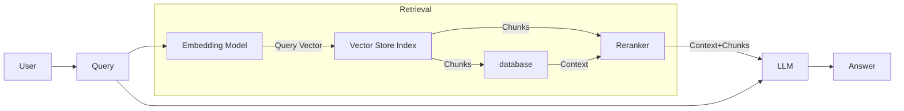

# SearchAI for Customer Support - Our Journey to Cost-Effective AI Solution

## Introduction

In the competitive world of e-commerce, efficient customer support is crucial for a company's reputation and customer retention. Our recent project involved deploying a cost-effective AI solution to improve this efficiency. Our recent project involved deploying a SearchAI Retrieval-Augmented Generation (RAG) solution for a client. This solution uses advanced language models to understand customer questions and provide relevant answers from our vast knowledge base. This cutting-edge technology allowed our customer service agents to deliver timely and precise responses, significantly improving the overall customer experience.  However, despite the impressive accuracy of the model, we encountered a sharp increase in the generative AI operational costs. Here’s an in-depth look at our journey, the challenges we faced, and the solutions that helped us strike a balance between cost-efficiency and accuracy.

## The Challenge

 We anticipated handling an overwhelming 500 million customer requests per year, which translated to a staggering $2 million annual bill for the AI system.
This exorbitant cost was simply unsustainable for our business, and we found ourselves at a crossroads. We had to find a way to maintain the accuracy and efficiency of our AI-powered customer support while drastically reducing the operational costs. It was a daunting task, but our team was determined to find a solution.

## Initial Implementation

The primary use case was quite straightforward: whenever a customer asked a question to an agent, the SearchAI system would automatically retrieve the most relevant answers from a pre-ingested knowledge base. Our initial setup involved segmenting knowledge articles into HTML chunks and processing these chunks through GPT-3.5-turbo-16k, as it supported the required token limit (approximately 6500 tokens per query).

### Technical Blueprint

Here’s a high-level illustration of our initial SearchAI RAG architecture:

Our journey to find a solution took us through several interesting approaches, each offering unique benefits and tradeoffs. We focused on optimizing every step of our process, from how we prepared our data to how we leveraged different AI models. Let's walk through the key strategies we explored:

### Our Journey to a Cost-Effective Solution:

After identifying the challenges we faced, our team embarked on a journey to find innovative ways to reduce costs while maintaining the quality of our AI-powered customer support. We explored several strategies, each offering unique benefits. Let's walk through these approaches in simple terms:

### 1. Exploring Different Embedding Models:
We began by investigating various embedding models, which are crucial components that help our system interpret and represent text. There are many such models available, each with its own strengths. We experimented with several of these, comparing their performance to find the one that offered the best balance of accuracy and cost-efficiency for our specific needs.
#### Different models we've experimented with:

- **QA MPnet Base (SearchAI default embedding Model)**
- **E5 Base Model**
- **BGE Base Model**
- **OpenAI ADA embeddings**

### 2. Fine-Tuning Embedding Models:
While exploring different models was a good start, we found that off-the-shelf solutions weren't always sufficient for our specific use case. To address this, we employed a technique called "fine-tuning" on the most promising model we had identified. This process involved further training the model on our client's specific data, aiming to make our system even more efficient at understanding and answering customer queries in the context of our client's business. By combining the strengths of existing models with customized training, we hoped to achieve a level of performance that neither approach could deliver on its own.

### 3. Improving How We Store Information:
Recognizing that HTML data might not be embedding model-friendly, we explored converting documents into Markdown or Plain Text. This included formats such as:

- Raw HTML
- Markdown
- Split Markdown using LangChain MarkdownHeaderTextSplitter
- Clean Text

### 4. Optimizing Chunking Strategies
Chunking the documents effectively is critical for maximizing retrieval accuracy and managing token budgets. Here’s a detailed look into the chunking strategies we explored:

We observed that maintaining the relative layout and structure of the original HTML documents led to better contextual understanding and retrieval accuracy. For this, we experimented with various chunk sizes and formats:

- **Chunk Size and Number**: We experimented with different chunk sizes (e.g., 200 tokens, 400 tokens) and the number of chunks per query (e.g., 8 chunks, 16 chunks). Smaller chunks (e.g., 200 tokens) generally preserve more context around specific details, while larger chunks (e.g., 400 tokens) provide broader context but may slightly dilute specific information.
  
- **Order and Proximity**: Ensuring the proximity of the chunks to the query in the prompt was vital for the LLM to generate relevant answers. The order in which chunks appear relative to the query also influences the quality of the answers, with more semantically relevant chunks placed nearer to the query.

#### Format-Sensitive Chunking

Beyond layout, the document format plays a crucial role in embedding generation:

- **Markdown Conversion**: By converting HTML to Markdown, we ensure cleaner, more structured input for embedding models.
- **Plain Text**: Simplifying documents to plain text often removes extraneous data and potential noise.

### 5. Prompt Engineering

We found that the structure of prompts significantly affects the quality of the generated answers. By refining our prompt engineering techniques to include relevant context, specific instructions, and examples to produce more accurate and context-appropriate responses. This optimization improved answer relevance, reduced unnecessary token usage, and enhanced overall performance and cost efficiency. Through iterative testing, we significantly improved the quality of our AI-generated customer support responses.

## Analysis and Top Solutions:

After exploring various approaches, we carefully analyzed their effectiveness in terms of retrieval accuracy and cost efficiency. Our rigorous testing revealed several promising solutions:

### 1. Clean Text with Finetuned BGE model:
   - Chunk Recall: 78.5%
   - Used 16 chunks of 200 tokens each
   - Average Tokens used: ~4k 

### 2. Clean Text with OpenAI ADA model:
   - Chunk Recall: 77.8%
   - Used 16 chunks of 200 tokens each
   - Average Tokens used: ~4k 

### 3. Markdown with OpenAI ADA model:
   - Chunk Recall: 76.6%
   - Used 8 chunks of 400 tokens each
   - Average Tokens used: ~4k 

### 4. Clean Text with OpenAI ADA model (Alternative Configuration):
   - Chunk Recall: 76.4%
   - Used 8 chunks of 200 tokens each
   - Average Tokens used: ~2k 

### 5. Clean Text with Finetuned BGE model (Alternative Configuration):
   - Chunk Recall: 73.8%
   - Used 8 chunks of 200 tokens each
   - Average Tokens used: ~2k 
   

## The Optimal Solution

After careful consideration of both performance and cost factors, we determined that the Clean Text with Finetuned BGE model offered the best balance for our needs. Here's why we chose this solution:

1. **Accuracy:** With a chunk recall of 78.5%, this solution provided the highest retrieval accuracy among all tested approaches, outperforming both the OpenAI ADA model and other configurations.

2. **Robustness:** The full configuration with 16 chunks of 200 tokens each ensures comprehensive coverage of the content, which may be beneficial for handling a wide range of queries.

3. **Customization:** The fine-tuning process allowed us to tailor the BGE model to our specific use case, potentially offering better performance on domain-specific queries compared to off-the-shelf models like OpenAI's ADA.

4. **Balanced Approach:** While this solution uses more tokens on average (~4k) compared to some alternatives, the superior accuracy justifies the slightly higher resource usage.

5. **Flexibility:** If needed, we have the option to switch to the alternative configuration (8 chunks of 200 tokens) which still maintains a respectable 73.8% chunk recall while using only ~2k tokens, offering a good balance between performance and cost.

This solution allows us to maximize accuracy in our customer support system while maintaining reasonable resource usage. The high chunk recall (78.5%) ensures that we're providing the most relevant information to customer queries.

By implementing this optimized solution, we can handle our high volume of customer queries with the highest demonstrated accuracy. This ensures that our AI-powered support system remains highly effective, providing the best possible responses to user inquiries.

However, it's worth noting that if cost becomes a more critical factor in the future, we have the flexibility to adopt the alternative configuration of the same model, which offers a good trade-off between performance and resource usage.

## Conclusion

Through strategic optimization and custom-tuning, we achieved significant cost savings while maintaining high accuracy in our AI-powered customer support system. This project underscores the potential of AI to enhance customer service efficiently and economically. This success underscores the importance of thorough analysis and strategic adjustments in building cost-efficient, high-performing AI systems.

Our experience highlights the immense potential of embedding models in revolutionizing customer support. These models offer a scalable solution that can handle millions of queries accurately while keeping operational expenses in check. It proves that with the right approach, businesses can harness AI to significantly improve customer support without incurring unsustainable costs.

This project demonstrates the transformative power of AI in customer support and the critical importance of thoughtful, strategic implementation. As AI technology evolves, we anticipate even more opportunities to enhance customer experiences while maintaining operational efficiency.
