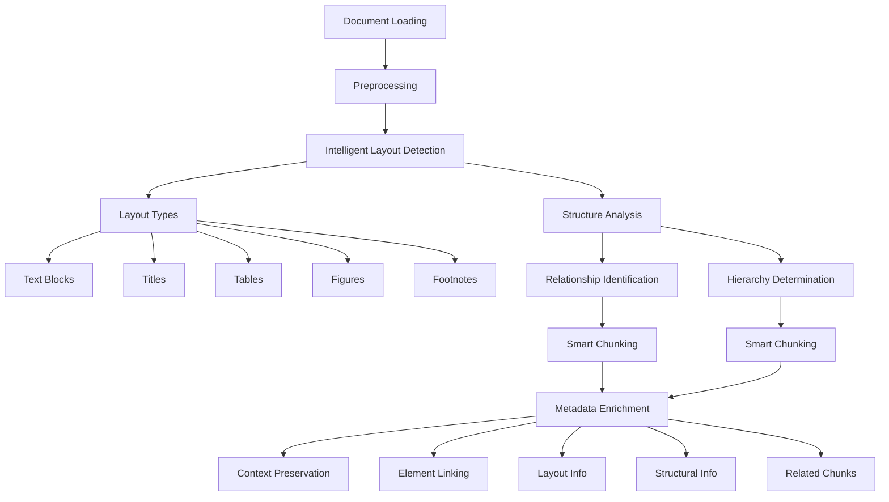

# Revolutionizing RAG Models with Layout-Aware Chunk Extraction: Mastering Complex PDFs

*Author: Vishwas Tak*

In today's data-driven world, the ability to quickly and accurately process complex documents is more crucial than ever. Retrieval-Augmented Generation (**RAG**) models have emerged as powerful tools in this arena, offering the promise of generating responses that are both accurate and contextually rich. However, these models have long grappled with a significant challenge: how to effectively handle documents with intricate layouts, tables, and images. Enter **layout-aware chunk extraction** – a revolutionary approach that's transforming how we process and understand sophisticated documents. This cutting-edge feature is now available in **SearchAI**.

## The Challenge of Complex Documents

Traditional **RAG models** rely on token-based chunking, a method that often falls short when faced with the intricacies of modern document structures. This approach can lead to several issues:

- **Context Loss:** In multi-column layouts, related information can be separated, leading to misinterpretation.
- **Data Misinterpretation:** Tables and charts, crucial in many industries, are often mangled or misunderstood.
- **Image-Text Disconnect:** The relationship between text and accompanying images is frequently lost.
- **Structure Disintegration:** The hierarchical structure of documents, vital in legal and academic texts, can be disrupted.

These limitations can result in **RAG models** producing responses that are inaccurate, incomplete, or lacking in nuance – a critical flaw in industries where precision is paramount.

## Advancing Layout-Aware Chunk Extraction

**Layout-aware chunk extraction** addresses these challenges head-on by employing advanced **AI techniques** to analyze and understand document structure before creating chunks. This approach, now available in **SearchAI**, preserves the context, layout, and relationships within the document, leading to significantly improved processing and understanding.

### How Layout-Aware Chunk Extraction Works

#### Document Loading and Preprocessing

1. Convert documents into high-quality images.
2. Extract text using advanced **OCR techniques**.
3. Preserve original formatting and layout information.

#### Intelligent Layout Detection

1. Employ **AI models** to identify various document elements:
   - **Text blocks and paragraphs**
   - **Titles and headers**
   - **Tables and their structures**
   - **Figures and their captions**
   - **Footnotes and sidebars**

#### Structure Analysis

1. Determine the document's **hierarchical structure**.
2. Identify relationships between different elements.

#### Smart Chunking

1. Create chunks based on the detected **layout and structure**.
2. Preserve context within and between chunks.
3. Maintain links between text and related visual elements.

#### Metadata Enrichment

1. Add layout and structural information to each chunk.
2. Include references to related chunks and elements.

### Types of Layout Extractors

Different types of documents require specialized approaches. Here are four key types of layout extractors:

#### Research Paper Extractor

- Optimized for academic and scientific documents.
- Focuses on preserving complex tables, figures, and citations.
- Maintains the logical flow of academic argumentation.

  

#### Book Extractor

- Ideal for long-form content with chapters and sections.
- Handles table of contents, indexes, and footnotes.
- Preserves narrative flow across pages and chapters.

  

#### Legal Document Extractor

- Specialized for contracts, laws, and regulatory texts.
- Preserves legal document hierarchy and formatting.
- Maintains cross-references and annotations.

  

#### General Extractor

- Versatile option for various document types.
- Balances layout detection with flexible chunking.
- Adapts to a wide range of formatting styles.

  

## Advantages of Layout-Aware Chunking

The benefits of this approach are numerous and significant:

- **Enhanced Context Preservation:** By maintaining the document's structure, the system ensures that related information stays together, improving the accuracy of subsequent analysis.
- **Improved Handling of Complex Elements:** Tables, charts, and images are processed in context, allowing for a more comprehensive understanding of the data they present.
- **Better Performance with Multi-Column Layouts:** The system can navigate complex page layouts, ensuring that information flow is maintained even in documents with sophisticated designs.
- **Heightened Semantic Understanding:** By preserving the document's structure, the system can better grasp the relationships between different parts of the text, leading to more nuanced interpretation.
- **Increased Accuracy in Information Retrieval:** With context-aware chunks, retrieval systems can more accurately pinpoint relevant information, improving the performance of **RAG models**.

## Real-World Applications

The impact of layout-aware chunk extraction, developed in **SearchAI**, is being felt across numerous industries:

- **Financial Sector:** Accurately process complex financial reports, regulatory filings, and investment prospectuses.
- **Legal Industry:** Enhance analysis of contracts, legal precedents, and regulatory documents, improving legal research and compliance efforts.
- **Academic Research:** Streamline literature reviews and improve information retrieval from scientific papers, accelerating the research process.
- **Technical Documentation:** Simplify the management and updating of complex manuals, specifications, and technical guides.
- **Healthcare:** Improve processing of medical records, research papers, and clinical guidelines, enhancing patient care and research efforts.

## Implementation Considerations

While the benefits of layout-aware chunk extraction are clear, there are several factors to consider during implementation:

- **Processing Resources:** The advanced **AI models** require more computational power, potentially increasing processing time and resource needs.
- **Customization:** Different document types may require fine-tuning of the extraction models for optimal performance.
- **Complex Layouts:** Highly unusual or complex document layouts may still present challenges, requiring ongoing refinement of the models.
- **Integration:** Implementing this new approach may require updates to existing document processing pipelines and **RAG models**.
- **Training:** Teams may need additional training to fully leverage the capabilities of **layout-aware systems**.

## The Future of Document Processing

As **AI** and **machine learning technologies** continue to advance, we can expect further developments in layout-aware document processing:

- **Improved Layout Detection:** More sophisticated models will be able to handle increasingly complex document structures.
- **Enhanced Multi-modal Understanding:** Better integration of text, image, and even video content within documents.
- **Real-time Processing:** Faster processors and optimized algorithms will enable real-time layout-aware chunking.
- **Expanded Language Support:** Improved handling of multilingual documents and non-Latin scripts.
- **Adaptive Learning:** Systems that can learn and adapt to new document types and layouts over time.

## Conclusion

**Layout-aware chunk extraction** represents a significant leap forward in document processing for **RAG models**. By preserving document structure and context, this approach enables more accurate and nuanced understanding of complex documents. As organizations across various industries continue to grapple with increasing volumes of sophisticated documents, adopting **layout-aware chunking** can provide a competitive edge in information retrieval and analysis.

The future of document processing is here, and it's **layout-aware**. By embracing this technology, organizations can unlock new levels of efficiency and insight from their document repositories, driving innovation and decision-making in the age of information.

This cutting-edge feature is available in [SearchAI](https://platform.kore.ai/).