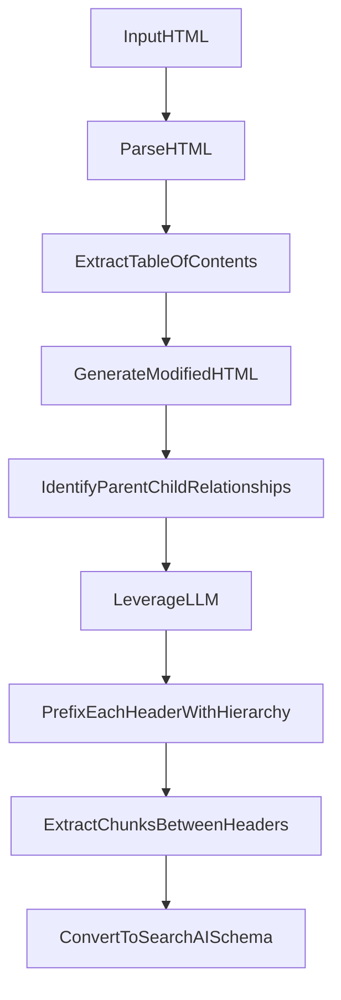

## Solving Document Structure Issues for Knowledge Extraction Using LLMs
*Author: Vishwas Tak*

Organizations often face problems with the structure and organization of content when extracting knowledge from large document repositories. This article describes a situation where a major banking client encountered difficulties while using the SearchAI platform to retrieve answers from Salesforce knowledge articles.

## Use Case: Bank's Transformation Journey

A top financial institution, dedicated to innovation and customer satisfaction, is on a mission to improve its customer care services using advanced search technologies. The Retail Banking Line of Business (LOB) is leading this effort, aiming to explore the potential of SearchAI for various applications.

The Retail team is spearheading an important project to use SearchAI for better customer care operations. They plan to process a large repository of 11,000 documents, each with an average of 10 pages. This extensive collection of content will serve as a valuable resource to provide accurate and comprehensive support to customers.

## The Challenges

1. **Incorrect Chunking**: When chunking the content based on tokens or other fixed criteria, the section headers might inadvertently include information from the previous section. This led to incorrect or incomplete answers being returned, as the context and boundaries of each section were not properly defined.

2. **Missing Hierarchy Information**: The table of contents within the documents had a hierarchical structure, but the parent-child relationship information was not available in every child section. This lack of explicit hierarchical information made it difficult to accurately capture the context and relationships between different sections, leading to potential misinterpretations or incomplete understanding.

 

## The Solution

To address these challenges, we developed a solution that involved preprocessing the HTML documents before extracting structured data. The key steps in our approach were:

## Parsing HTML for Structured Data Extraction

### **1. Parse HTML**
The first step is to parse the input HTML document to extract its structure and content using libraries like BeautifulSoup.

### **2. Extract and Expand Table of Contents (TOC)**
From the parsed HTML, we identify and extract the table of contents or index structure, which represents the sections and subsections of the document. This is typically done by analyzing specific HTML tags like `<ul>`, `<ol>`, etc. Additionally, we expand the TOC by handling situations where one index element may point to sub-indices within the same page, ensuring a comprehensive representation of the document's structure.

### **3. Generate Modified HTML**
After expaning the TOC, we generate a modified version of the HTML document that incorporates the updated structure.

### **4. Identify Parent-Child Relationships**
Using the extracted headers structure, we analyze and identify the parent-child relationships between the different sections and subsections. This involves understanding the nesting and hierarchy of the headers.

### **5. Leverage LLM for Hierarchical Expansion**
To overcome the challenge of missing hierarchy information, we leverage the power of Large Language Models (LLMs). We feed the extracted headers structure to the LLM, which analyzes the context and relationships between the headers and provides a hierarchical representation, including the parent-child relationships.

### **6. Prefix Each Header**
With the identified relationships from the LLM's output, we prefix each header with its parent section(s), providing the necessary context and hierarchy information.

### **7. Output Modified HTML**
The modified HTML document is then ready for further processing, such as extracting structured data.

### **8. Extract Chunks Between Headers**
To extract meaningful chunks of content, we iterate through the modified HTML document, locating the correct tags using the reference links (`href`) provided in the headings. We then collect all the intermediate elements until the next heading (present in the index) is encountered. These intermediate elements are combined into a single chunk, preserving the hierarchical context and boundaries between sections.

By leveraging the LLM's capabilities to understand and expand the hierarchical structure of the headers, and subsequently preprocessing the documents with explicit parent-child relationships, we provided the necessary context for accurate knowledge extraction.

### Implementation and Open-Source Contribution
The implementation of this solution is available as an open-source project on GitHub: [SearchAssist-Toolkit](https://github.com/username/SearchAssist-Toolkit). We believe that sharing this approach and code can benefit the broader community working with knowledge extraction and document understanding.

### Conclusion
Dealing with complex document structures and hierarchies can be a significant challenge when extracting knowledge. By leveraging the LLM's capabilities to understand and expand the hierarchical structure, and incorporating explicit parent-child relationships through preprocessing, we can provide the necessary context and significantly improve the accuracy of the extracted information. 

The solution presented in this article demonstrates how a combination of HTML parsing, header analysis, LLM integration, document modification, and intelligent chunking can effectively address these challenges. This approach not only solved our client's specific issues but also highlights the importance of understanding and addressing the intricacies of document structure when working with knowledge extraction and natural language processing tasks. By extracting high-quality, meaningful chunks that preserve the hierarchical context, we can ensure better retrieval accuracy. As organizations continue to leverage LLMs for various applications, such preprocessing techniques will become increasingly valuable in ensuring accurate and context-aware knowledge extraction from diverse document repositories.
