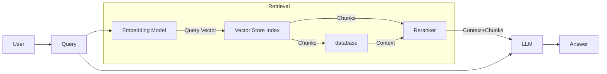

# SearchAI for Customer Support - Our Journey to Cost-Effective AI Solution

*Author: Akhil Sainath Maddala*

## Introduction

In the competitive world of e-commerce, efficient customer support is crucial for a company's reputation and customer retention. Our recent project involved deploying a SearchAI Retrieval-Augmented Generation (RAG) solution for a client. This solution uses advanced language models to understand customer questions and provide relevant answers from our vast knowledge base. This cutting-edge technology allowed our customer service agents to deliver timely and precise responses, significantly improving the overall customer experience.  However, despite the impressive accuracy of the model, we encountered a sharp increase in the generative AI operational costs. Here’s an in-depth look at our journey, the challenges we faced, and the solutions that helped us strike a balance between cost-efficiency and accuracy.

## The Challenge

 We anticipated handling an overwhelming 500 million customer requests per year, which translated to a staggering $2 million annual bill for the AI system.
This exorbitant cost was simply unsustainable for our business, and we found ourselves at a crossroads. We had to find a way to maintain the accuracy and efficiency of our AI-powered customer support while drastically reducing the operational costs. It was a daunting task, but our team was determined to find a solution.

## Initial Implementation

The primary use case was quite straightforward: whenever a customer asked a question to an agent, the SearchAI system would automatically retrieve the most relevant answers from a pre-ingested knowledge base. Our initial setup involved segmenting knowledge articles into HTML chunks and processing these chunks through GPT-3.5-turbo-16k, as it supported the required token limit (approximately 6500 tokens per query).

### Data Overview

Our knowledge base comprised 3,000 HTML documents on e-commerce customer support, presenting unique challenges for general retrieval systems. The content was rich in industry-specific jargon and terminology, with overlapping information across various topics. The HTML format and domain-specific nature, including unique product names and policies, required careful preprocessing and interpretation. These characteristics demanded a specialized, domain-aware RAG system capable of navigating e-commerce complexities and effectively handling information redundancy.

### Technical Blueprint

Here’s a high-level illustration of our initial SearchAI RAG architecture:

## Our Journey to a Cost-Effective Solution

Faced with high operational costs, our team embarked on an innovative journey to optimize our AI-powered customer support system. We meticulously refined every step of our process, from data preparation to model selection and implementation. Our exploration led us through various approaches, each offering unique benefits and trade-offs.
  
To evaluate the performance of our different configurations, we primarily focused on chunk recall as our key metric. This measure provides valuable insight into how effectively each solution retrieves relevant information, which is crucial for the accuracy and completeness of responses in our RAG system.
  
**Chunk Recall:**
The percentage of questions for which at least one chunk from the given expected source is included in the top n chunks sent to the LLM for generating an answer.

 Let's explore the key strategies that guided us to our ultimate solution.
 
### 1. Improving How We Store Information:
Recognizing that HTML data might not be embedding model-friendly, we explored converting documents into Markdown or Plain Text. This included formats such as:

- Markdown
- Clean Text
  

> #### Key Insight
> This optimization of document storage formats yielded tangible benefits. By converting HTML to more embedding-friendly formats, we achieved a notable boost in system performance. Specifically, we observed an average improvement in chunk recall ranging from 3% to 15%(Please refer experiment IDs from 1 to 4 under Solutions Comparison table). This significant enhancement in retrieval accuracy demonstrates the critical role that appropriate document representation plays in the effectiveness of embedding-based retrieval systems.

### 2. Optimizing Chunking Strategies

Effective document chunking is a critical component in RAG systems, directly impacting both retrieval accuracy and token budget management. Our optimization process focused on fine-tuning chunk characteristics and adapting to different document formats. Here's an overview of our approach:

#### Fine-tuning Chunk Characteristics

Our experimentation encompassed two crucial aspects:

- **Chunk Size and Number**: We tested various combinations, including 200-token and 400-token chunks, and different numbers of chunks per query (8 and 16). Smaller chunks (200 tokens) tended to preserve more specific contextual details, while larger chunks (400 tokens) provided broader context at the risk of slightly diluting specific information.

- **Order and Proximity**: We found that the arrangement of chunks within the prompt significantly affected the LLM's ability to generate relevant answers. Placing semantically relevant chunks closer to the query improved response quality.

#### Format-Sensitive Chunking

Recognizing that document format plays a crucial role in embedding generation, we explored format-specific strategies:

- **Markdown-Aware Chunking**: We transformed HTML documents into Markdown format, providing cleaner, more structured input for our embedding models. To further enhance our chunking strategy, we utilized LangChain's MarkdownHeaderTextSplitter. This tool allowed us to create chunks that respect the hierarchical structure of Markdown documents, preserving the context provided by headers and subheaders. By converting to Markdown and using a specialized splitter, we maintained document structure and semantic relationships, leading to more meaningful and context-aware embeddings.

    This approach to format-sensitive chunking enabled us to better preserve document structure and semantic relationships throughout the embedding process.

By addressing these key areas, we were able to develop a chunking strategy that balanced preserving document context, optimizing for token efficiency, and accommodating various document formats.

### 3. Exploring Different Embedding Models:
We began by investigating various embedding models, which are crucial components that help our system interpret and represent text. Our selection process was guided by performance metrics and industry benchmarks.Specifically, at the time we were exploring different embedding models, we chose E5 Base and BGE Base models based on their high rankings in retrieval accuracy on the MTEB (Massive Text Embedding Benchmark) leaderboard. Additionally, we included OpenAI's ADA embeddings in our evaluation due to its diverse training dataset, which potentially offers robust generalization capabilities. Here are the different models we experimented with:

- [**E5 Base Model**](https://huggingface.co/intfloat/e5-base)
- [**BGE Base Model**](https://huggingface.co/BAAI/bge-base-en-v1.5)
- [**OpenAI ADA embeddings**](https://platform.openai.com/docs/guides/embeddings/embedding-models)
    
 > #### Key Insight
> Our experimentation with various embedding models yielded significant results. Compared to the default model, we observed a substantial increase in performance, with chunk recall improving by an average of 7-15%(Please refer to experiments 2,6,8,9 under Solutions Comparison table). This marked improvement underscores the importance of selecting the right embedding model for enhancing retrieval accuracy in RAG systems.

### 4. Fine-Tuning Embedding Models:
While exploring different models was a good start, we found that off-the-shelf solutions weren't always sufficient for our specific use case. To address this, we employed a technique called "fine-tuning" on the most promising model we had identified. This process involved further training the model on our client's specific data, aiming to make our system even more efficient at understanding and answering customer queries in the context of our client's business. By combining the strengths of existing models with customized training, we hoped to achieve a level of performance that neither approach could deliver on its own.

 > #### Key Insight
>  This fine-tuning process led to a notable enhancement in retrieval performance, with chunk recall improved by over 13% compared to the SearchAI default model (see experiments 2 & 10) and by over 7% versus the top-performing pre-trained model(see experiments 7 & 10 under Solutions Comparison table). This improvement underscores the value of tailoring embedding models to specific domains and datasets, even when starting with high-quality pre-trained models.

### 5. Prompt Engineering

We found that the structure of prompts significantly affects the quality of the generated answers. By refining our prompt engineering techniques to include relevant context, specific instructions, and examples to produce more accurate and context-appropriate responses. This optimization improved answer relevance, reduced unnecessary token usage, and enhanced overall performance and cost efficiency. Through iterative testing, we significantly improved the quality of our AI-generated customer support responses.

## Analysis and Top Solutions:

Through our extensive testing, we have identified several promising solutions. Here is a brief overview of the top five configurations that have shown the most potential:

### Comparison of Models
| Configuration                                            | Chunk Recall | No. of Chunks Sent to LLM | Tokens per Chunk | Average Tokens Used | Details                                                                                             |
|----------------------------------------------------------|--------------|--------------------------|------------------|---------------------|-----------------------------------------------------------------------------------------------------|
| Clean Text with Finetuned BGE model                      | 78.5%        | 16 chunks                | 200              | ~4k                 | Cleaned data with a fine-tuned BGE model, using 16 chunks of 200 tokens each, approximately 4k tokens used for generating an answer. |
| Clean Text with OpenAI ADA model                         | 77.8%        | 16 chunks                | 200              | ~4k                 | Cleaned data with OpenAI ADA model, using 16 chunks of 200 tokens each, approximately 4k tokens used for generating an answer.      |
| Markdown with OpenAI ADA model                           | 76.6%        | 8 chunks                 | 400              | ~4k                 | Markdown data with OpenAI ADA model, using 8 chunks of 400 tokens each, approximately 4k tokens used for generating an answer.      |
| Clean Text with OpenAI ADA model (Alternative Config)    | 76.4%        | 8 chunks                 | 200              | ~2k                 | Cleaned data with OpenAI ADA model, using 8 chunks of 200 tokens each, approximately 2k tokens used for generating an answer.       |
| Clean Text with Finetuned BGE model (Alternative Config) | 73.8%        | 8 chunks                 | 200              | ~2k                 | Cleaned data with a fine-tuned BGE model, using 8 chunks of 200 tokens each, approximately 2k tokens used for generating an answer. |

   For a comprehensive analysis of all the solutions we have considered, refer to the details below:
     
### Solutions Comparison table

## The Optimal Solution

After careful consideration of both performance and cost factors, we determined that the Clean Text with Finetuned BGE model offered the best balance for our needs. Here's why we chose this solution:

1. **Accuracy:** With a chunk recall of 78.5%, this solution provided the highest retrieval accuracy among all tested approaches, outperforming both the OpenAI ADA model and other configurations.

2. **Robustness:** The full configuration with 16 chunks of 200 tokens each ensures comprehensive coverage of the content, which may be beneficial for handling a wide range of queries.

3. **Customization:** The fine-tuning process allowed us to tailor the BGE model to our specific use case, potentially offering better performance on domain-specific queries compared to off-the-shelf models like OpenAI's ADA.

4. **Balanced Approach:** While this solution uses more tokens on average (~4k) compared to some alternatives, the superior accuracy justifies the slightly higher resource usage.

5. **Flexibility:** If needed, we have the option to switch to the alternative configuration (8 chunks of 200 tokens) which still maintains a respectable 73.8% chunk recall while using only ~2k tokens, offering a good balance between performance and cost.

This solution allows us to maximize accuracy in our customer support system while maintaining reasonable resource usage. The high chunk recall (78.5%) ensures that we're providing the most relevant information to customer queries.

By implementing this optimized solution, we can handle our high volume of customer queries with the highest demonstrated accuracy. This ensures that our AI-powered support system remains highly effective, providing the best possible responses to user inquiries.

However, it's worth noting that if cost becomes a more critical factor in the future, we have the flexibility to adopt the alternative configuration of the same model, which offers a good trade-off between performance and resource usage.

## Conclusion

Through strategic optimization and custom-tuning, we achieved significant cost savings while maintaining high accuracy in our AI-powered customer support system. This project underscores the potential of AI to enhance customer service efficiently and economically. This success underscores the importance of thorough analysis and strategic adjustments in building cost-efficient, high-performing AI systems.

Our experience highlights the immense potential of embedding models in revolutionizing customer support. These models offer a scalable solution that can handle millions of queries accurately while keeping operational expenses in check. It proves that with the right approach, businesses can harness AI to significantly improve customer support without incurring unsustainable costs.

This project demonstrates the transformative power of AI in customer support and the critical importance of thoughtful, strategic implementation. As AI technology evolves, we anticipate even more opportunities to enhance customer experiences while maintaining operational efficiency.
